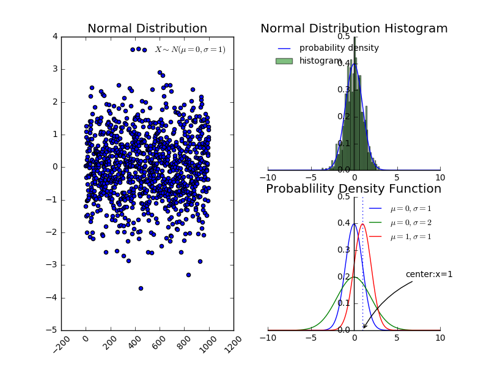
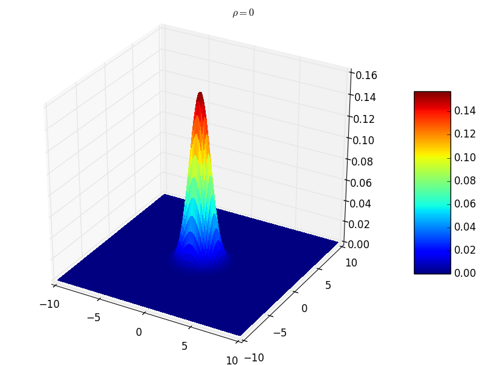
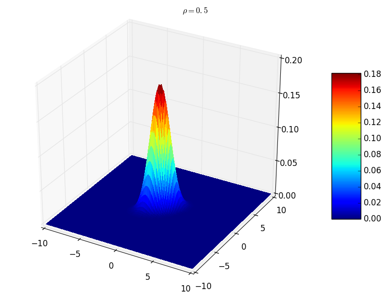
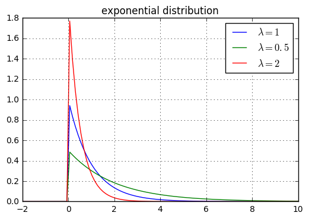
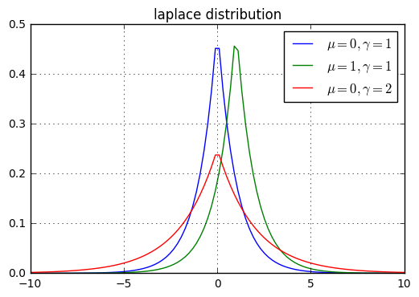

# 概率论基础

## 概率与分布

### 条件概率与独立事件
1. 条件概率：已知 $A$ 事件发生的条件下 $B$ 发生的概率，记作 $P(B|A)$，它等于事件 $AB$ 的概率相对于事件 $A$ 的概率，即：
$$
P(B|A)=\frac{P(AB)}{P(A)}
$$
其中必须有$P(A)>0$
2. 条件概率分布的链式法则：对于 $n$ 个随机变量 $\mathbf{x_{1},x_{2},\cdots,x_{n}}$，有：
$$
P(\mathbf{x}_{1},\mathbf{x}_{2},\cdots,\mathbf{x}_{n})=
P(\mathbf{x}_{1})\prod_{i=2}^{n}P(\mathbf{x}_{i}|\mathbf{x}_{1},\cdots,\mathbf{x}_{i-1})
$$
3. 两个随机变量 $\mathbf{x,y}$ 相互独立的数学描述：
$$
\forall x\in \mathcal{X},\forall y\in \mathcal{Y},P(\mathbf{x}=x,\mathbf{y}=y)=P(\mathbf{x}=x)P(\mathbf{y}=y)
$$
记作： $\mathbf{x}\bot\mathbf{y}$
4. 两个随机变量 $\mathbf{x,y}$ 关于随机变量 $z$ 条件独立的数学描述：
$$
\begin{aligned}
    & \forall x\in\mathcal{X},\forall y\in\mathcal{Y},\forall z\in\mathcal{Z} \\
    & P(\mathbf{x}=x,\mathbf{y}=y,\mathbf{z}=z)=P(\mathbf{x}=x|\mathbf{z}=z)P(\mathbf{y}=y|\mathbf{z}=z)
\end{aligned}
$$
记作： $(\mathbf{x}\bot\mathbf{y})|\mathbf{z}$
### 联合概率分布

1. 定义 $\mathbf{x}$ 和 $\mathbf{y}​$ 的联合分布为：
$$
P(a,b)=P\{\mathbf{x}\le a,\mathbf{y}\le b \},-\infty <a,b <+\infty
$$
2. $\mathbf{x}$ 的分布可以从联合分布中得到：
$$
P_{x}(a)=P\{\mathbf{x}\le a\}=
P\{\mathbf{x}\le a,\mathbf{y}\le\infty\}=P(a,\infty),-\infty<a<+\infty
$$
类似的，$\mathbf{y}$ 的分布可以从联合分布中得到：
$$
P_{y}(b)=P\{\mathbf{y}\le b\}=
P\{\mathbf{x}\le \infty,\mathbf{y}\le b\}=P(\infty,b),-\infty<b<+\infty
$$
3. 当 $\mathbf{x}$ 和 $\mathbf{y}$ 都是离散随机变量时， 定义 $\mathbf{x}$ 和 $\mathbf{y}$ 的联合概率质量函数为： $p(x,y)=P\{ \mathbf{x}=x,\mathbf{y}=y\}$
则 $\mathbf{x}$ 和 $\mathbf{y}$ 的概率质量函数分布为：
$$
p_{\mathbf{x}}(x)=\sum_{y:p(x,y)>0}p(x,y),
p_{\mathbf{y}}(y)=\sum_{x:p(x,y)>0}p(x,y),
$$
4. 当 $\mathbf{x}$ 和 $\mathbf{y}$ 联合地连续时，即存在函数 $p(x,y)$ ，使得对于所有的实数集合 $A$ 和 $B$ 满足：
$$
P\{ \mathbf{x}\in A,\mathbf{y}\in B \}=
\int_{B}\int_{A}p(x,y)dxdy
$$
则函数 $p(x,y)$ 称为 $\mathbf{x}$ 和 $\mathbf{y}$ 的概率密度函数。
* 联合分布为
$$
P(a,b)=P\{ \mathbf{x}\le a,\mathbf{y}\le begin \}=
\int_{-\infty}^{a}\int_{-\infty}^{b}p(x,y)dxdy
$$
* $\mathbf{x}$和 $\mathbf{y}$ 的概率密度函数以及分布函数分别为：
$$
\begin{aligned}
    & P_{\mathbf{x}}(a)=\int_{-\infty}^{a}\int_{-\infty}^{\infty}p(x,y)dxdy=\int_{-\infty}^{a}p_{\mathbf{x}}(x)dx \\
    & P_{\mathbf{y}}(b)=\int_{-\infty}^{\infty}\int_{-\infty}^{b}p(x,y)dxdy=\int_{-\infty}^{b}p_{\mathbf{y}}(y)dy \\
    & p_{\mathbf{x}}(x)=\int_{-\infty}^{\infty}p(x,y)dy \\
    & p_{\mathbf{y}}(y)=\int_{-\infty}^{\infty}p(x,y)dx
\end{aligned}
$$

## 期望
1. 期望：（是概率分布的泛函，函数的函数）
* 离散型随机变量 $\mathbf{x}$ 的期望：
$$
\mathbb{E}[x]=\sum_{i=1}^{\infty}x_{i}p_{i}
$$
若级数不收敛，则期望不存在
* 连续性随机变量 $\mathbf{x}$ 的期望：
$$
\mathbb{E}[x]=\int_{-\infty}^{\infty}xp(x)dx
$$
若极限不收敛，则期望不存在
2. 期望描述了随机变量的平均情况，衡量了随机变量 $\mathbf{x}$ 的均值
3. 定理：设 $\mathbf{y}=g(\mathbf{x})$ 均为随机变量，$g(\cdot)$ 是连续函数
* 若 $\mathbf{x}$ 为离散型随机变量，若 $\mathbf{y}$ 的期望存在，则：
$$
\mathbb{E}[\mathbf{y}]=\mathbb{E}[g(\mathbf{x})]=\sum_{i=1}^{\infty}g(x_{i})p_{i}
$$
* 若 $\mathbf{x}$ 为连续型随机变量，若 $\mathbf{y}$ 的期望存在，则 ：
$$
\mathbb{E}[\mathbf{y}]=\mathbb{E}[g(\mathbf{x})]=\int_{-\infty}^{\infty}g(x)p(x)dx
$$
该定理的意义在于：当求 $\mathbb{E}(\mathbf{y})$ 时，不必计算出 $\mathbf{y}$ 的分布，只需要利用 $\mathbf{x}$ 的分布即可。该定理可以推广至两个或者两个以上随机变量的情况。此时：
$$
\mathbb{E}[\mathbf{z}]=\mathbb{E}[g(\mathbf{x,y})]=\int_{-\infty}^{\infty}\int_{-\infty}^{\infty}g(x,y)p(x,y)dxdy
$$
>上述公式也记做：
$$
\begin{aligned}
    & \mathbb{E}_{\mathbf{x}\sim P}[g(x)]=\sum_{x}g(x)p(x) \\
    & \mathbb{E}_{\mathbf{x}\sim P}[g(x)]=\int_{x}g(x)p(x)dx \\
    & \mathbb{E}_{\mathbf{x},\mathbf{y}\sim P}[g(x,y)]=\int_{x}g(x,y)p(x,y)dxdy \\
\end{aligned}
$$
4. 期望性质：
* 常数的期望就是常数本身
* 对常数 $C$ 有 ：
$$
\mathbb{E}[C\mathbf{x}]=C\mathbb{E}[\mathbf{x}]
$$
* 对两个随机变量 $\mathbf{x,y}$ ，有：
$$
\mathbb{E}[\mathbf{x+y}]=\mathbb{E}[\mathbf{x}]+\mathbb{E}[\mathbf{y}]
$$
该结论可以推广到任意有限个随机变量之和的情况
* 对两个相互独立的随机变量，有：
$$
\mathbb{E}[\mathbf{xy}]=\mathbb{E}[\mathbf{x}]\mathbb{E}[\mathbf{y}]
$$
该结论可以推广到任意有限个相互独立的随机变量之积的情况
## 方差

### 方差
1. 对随机变量 $\mathbf{x}$ ，若 $\mathbb{E}[(\mathbf{x}-\mathbb{E}[\mathbf{x}])^{2}]$ 存在，则称它为 $\mathbf{x}$ 的方差，记作 $\mathrm{Var}[\mathbf{x}]$ 。 $\mathbf{x}$ 的标准差为方差的开平方。即：
$$
\begin{aligned}
    & \mathrm{Var}[\mathbf{x}]=\mathbb{E}[(\mathbf{x}-\mathbb{E}[\mathbf{x}])^{2}] \\
    & \sigma=\sqrt{\mathrm{Var}[\mathbf{x}]}
\end{aligned}
$$
* 方差度量了随机变量 $\mathbf{x}$ 与期望值偏离的程度，衡量了 $\mathbf{x}$  取值分散程度的一个尺度。
* 由于绝对值 $|\mathbf{x}-\mathbb{E}[\mathbf{x}]|$ 带有绝对值，不方便运算，因此采用平方来计算。又因为 $|\mathbf{x}-\mathbb{E}[\mathbf{x}]|^{2}$ 是一个随机变量，因此对它取期望，即得 $\mathbf{x}$ 与期望值偏离的均值
2. 根据定义可知：
$$
\begin{aligned}
    & \mathrm{Var}[\mathbf{x}]=\mathbb{E}[(\mathbf{x}-\mathbb{E}[\mathbf{x}])^{2}]=\mathbb{E}[\mathbb{x}^{2}]-(\mathbb{E}[\mathbf{x}])^{2} \\
    & \mathrm{Var}[f(\mathbf{x})]=\mathbb{E}[(f(\mathbf{x})-\mathbb{E}[f(\mathbf{x})])^{2}]
\end{aligned}
$$
3. 对于一个期望为 $\mu$， 方差为 $\sigma^{2},\sigma\neq0$ 的随机变量 $\mathbf{x}$，随机变量 $\mathbf{x}^{*}=\frac{\mathbf{x}-\mu}{\sigma}$ 的数学期望为0，方差为1。 称 $\mathbf{x}^{*}$ 为 $\mathbf{x}$ 的标准化变量
4. 方差的性质：
* 常数的方差恒为0
* 对常数 $C$ 有 $\mathrm{Var}[C\mathbf{x}]=C^{2}\mathrm{Var}[\mathbf{x}]$
* 对两个随机变量 $\mathbf{x,y}$，有： $\mathrm{Var}[\mathbf{x+y}]=\mathrm{Var}[\mathbf{x}]+\mathrm{Var}[\mathbf{y}]+2\mathbb{E}[(\mathbf{x}-\mathbb{E}[\mathbf{x}])(\mathbf{y}-\mathbb{E}[\mathbf{y}])]$
    * 当 $\mathbf{x}$  和 $\mathbf{y}$ 相互独立时，有 $\mathrm{Var}[\mathbf{x+y}]=\mathrm{Var}[\mathbf{x}]+\mathrm{Var}[\mathbf{y}]$ 。可以推广至任意有限多个相互独立的随机变量之和的情况
* $\mathrm{Var}[\mathbf{x}]=0$ 的充要条件是 $\mathbf{x}$ 以概率1取常数
### 协方差与相关系数
1. 对于二维随机变量 $(\mathbf{x,y})$ ，可以讨论描述 $\mathbf{x}$ 与 $\mathbf{y}$ 之间相互关系的数字特征。
* 定义  $\mathbb{E}[(\mathbf{x}-\mathbb{E}[\mathbf{x}])(\mathbf{y}-\mathbb{E}[\mathbf{y}])]$ 为随机变量 $\mathbf{x}$ 与 $\mathbf{y}$ 的协方差，记作 $\mathrm{Cov}[\mathbf{x,y}]=\mathbb{E}[(\mathbf{x}-\mathbb{E}[\mathbf{x}])(\mathbf{y}-\mathbb{E}[\mathbf{y}])]$  。
* 定义 $\rho_{\mathbf{x,y}}=\frac{\mathrm{Cov[\mathbf{x,y}]}}{\sqrt{\mathrm{Var}[\mathbf{x}]\mathrm{Var}[\mathbf{y}]}}$  为随机变量 $\mathbf{x}$ 与　$\mathbf{y}$　的相关系数，它是协方差的归一化。
2. 由定义可知：
$$
\begin{aligned}
    & \mathrm{Cov}[\mathbf{x,y}]=\mathrm{Cov}[\mathbf{y,x}] \\
    & \mathrm{Cov}[\mathbf{x,x}]=\mathrm{Var}[\mathbf{x}] \\
    & \mathrm{Var}[\mathbf{x+y}]=\mathrm{Var}[\mathbf{x}]+\mathrm{Var}[\mathbf{y}]+2\mathrm{Cov}[\mathbf{x,y}]
\end{aligned}
$$
3. 协方差的性质：
* $\mathrm{Cov}[a\mathbf{x},b\mathbf{y}]=ab\mathrm{Cov}[\mathbf{x,y}],a,b$为常数
* $\mathrm{Cov}[\mathbf{x}_{1}+\mathbf{x}_{2},\mathbf{y}]=\mathrm{Cov}[\mathbf{x}_{1},\mathbf{y}]+\mathrm{Cov}[\mathbf{x}_{2},\mathbf{y}]$
* $\mathrm{Cov}[f(\mathbf{x}),g(\mathbf{y})]=\frac{\mathrm{Cov}[f(\mathbf{x}),g(\mathbf{y})]}{\sqrt{\mathrm{Var}[f(\mathbf{x})]\mathrm{Var}[f(\mathbf{y})]}}$
4. 协方差的物理意义：
* 协方差的绝对值越大，说明两个随机变量都远离它们的均值。
* 协方差如果为正，则说明两个随机变量同时趋向于取较大的值；如果为负，则说明一个随变量趋向于取较大的值，另一个随机变量趋向于取较小的值
* 两个随机变量的独立性可以导出协方差为零。但是两个随机变量的协方差为零无法导出独立性
    * 因为独立性也包括：没有非线性关系。有可能两个随机变量是非独立的，但是协方差为零
    * 假设随机变量 $\mathbf{x}\sim U[-1,1]$ 。定义随机变量 $\mathbf{s}$ 的概率分布函数为：$P(\mathbf{s}=1)=\frac{1}{2}P(\mathbf{s}=-1)=\frac{1}{2}$,定义随机变量 $\mathbf{y=sx}$，则随机变量 $\mathbf{x,y}$ 是非独立的，但是有： $\mathrm{Cov}[\mathbf{x,y}]=0$
5. 相关系数的物理意义：考虑以随机变量 $\mathbf{x}$ 的线性函数 $a+b\mathbf{x}$ 来近似表示 $\mathbf{y}$ 。以均方误差
$$
e=\mathbb{E}[(\mathbf{y}-(a+b\mathbf{x}))^{2}]=
\mathbb{E}[\mathbf{y}^{2}]+b^{2}\mathbb{E}[\mathbf{x}^{2}]+a^{2}
-2b\mathbb{E}[\mathbf{xy}]+2ab\mathbb{E}[\mathbf{x}]-2a\mathbb{E}[\mathbf{y}]
$$
来衡量以 $a+b\mathbf{x}$ 近似表达 $\mathbf{y}$ 的好坏程度。 $e$ 越小表示近似程度越高。为求得最好的近似，则对 $a,b$ 分别取偏导数，得到：
$$
\begin{aligned}
    & a_{0}=\mathbb{E}[\mathbf{y}]-b_{0}\mathbb{E}[\mathbf{x}]=
    \mathbb{E}[\mathbf{y}]-\mathbb{E}[\mathbf{x}]\frac{\mathrm{Cov}[\mathbf{x,y}]}{\mathrm{Var}[\mathbf{x}]} \\
    & b_{0}=\frac{\mathrm{Cov}[\mathbf{x,y}]}{\mathrm{Var}[\mathbf{x}]} \\
    & \min(e)=\mathbb{E}[(\mathbf{y}-(a_{0}+b_{0}\mathbf{x}))^{2}]=
    (1-\rho_{\mathbf{xy}}^{2})\mathrm{Var}[\mathbf{y}]
\end{aligned}
$$
因此有以下定理：
* $|\rho_{\mathbf{xy}}|\leq1$($|\cdots|$是绝对值)
* $\rho_{\mathbf{xy}=1}$ 的充要条件是，存在常数 $a,b$ 使得 $P\{ \mathbf{y}=a+b\mathbf{x} \}=1$
>当 $\rho_{\mathbf{xy}}$ 较大时， $e$ 较小，表明随机变量 $\mathbf{x}$ 和 $\mathbf{y}$ 联系较紧密，于是 $\rho_{\mathbf{xy}}$ 是一个表征 $\mathbf{x}$ ，$\mathbf{y}$ 之间线性关系紧密程度的量。
6. 当 $\rho_{\mathbf{xy}}=0$ 时，称 $\mathbf{x}$ 和 $\mathbf{y}$ 不相关。
* 不相关是就线性关系来讲的，而相互独立是一般关系而言的。
* 相互独立一定不相关；不相关则未必独立。

### 协方差矩阵

1. 矩：设 $\mathbf{x}$ 和 $\mathbf{y}$ 是随机变量
* 若 $\mathbb{E}[\mathbf{x}^{k}],k=1,2,\cdots$  存在，则称它为 $\mathbf{x}$ 的 $k$ 阶原点矩，简称 $k$ 阶矩
* 若 $\mathbb{E}[(\mathbf{x}-\mathbb{E}[\mathbf{x}])^{2}],k=2,3,\cdots$  存在，则称它为 $\mathbf{x}$ 的 $k$ 阶中心矩
* 若 $\mathbb{E}[\mathbf{x}^{k}\mathbf{y}^{l}],k,l=1,2,\cdots$  存在，则称它为 $\mathbf{x}$ 和 $\mathbf{y}$ 的 $k+l$ 阶混合矩
* 若  $\mathbb{E}[(\mathbf{x}-\mathbb{E}[\mathbf{x}])^{k}(\mathbf{y}-\mathbb{E}[\mathbf{y}])^{l}],k,l=1,2,\cdots$ 存在，则称它为 $\mathbf{x}$ 和 $\mathbf{y}$ 的 $k+l$ 阶混合中心矩
因此期望是一阶原点矩，方差是二阶中心矩，协方差是二阶混合中心矩
2. 协方差矩阵：二维随机变量 $(\mathbf{x}_{1},\mathbf{x}_{2})$ 有四个二阶中心矩（设他们都存在），记作：
$$
\begin{aligned}
    & c_{11}=\mathbb{E}[(\mathbf{x}_{1}-\mathbb{E}[\mathbf{x}_{1}])^{2}] \\
    & c_{12}=\mathbb{E}[(\mathbf{x}_{1}-\mathbb{E}[\mathbf{x}_{1}])(\mathbf{x}_{2}-\mathbb{E}[\mathbf{x}_{2}])] \\
    & c_{21}=\mathbb{E}[(\mathbf{x}_{2}-\mathbb{E}[\mathbf{x}_{2}])(\mathbf{x}_{1}-\mathbb{E}[\mathbf{x}_{1}])] \\
    & c_{22}=\mathbb{E}[(\mathbf{x}_{2}-\mathbb{E}[\mathbf{x}_{2}])^{2}]
\end{aligned}
$$
这个矩阵称作随机变量 $(\mathbf{x}_{1},\mathbf{x}_{2})$ 的协方差矩阵。
设 $n$ 维随机变量 $(\mathbf{x}_{1},\mathbf{x}_{2},\cdots,\mathbf{x}_{n})$ 的二阶混合中心矩 $c_{i,j}=\mathrm{Cov}[\mathbf{x}_{i},\mathbf{x}_{j}]=\mathbb{E}[(\mathbf{x}_{i}-\mathbb{E}[\mathbf{x}_{i}])(\mathbf{x}_{j}-\mathbb{E}[\mathbf{x}_{j}])],i,j=1,2,\cdots,n$ , 都存在，则称矩阵
$$
\mathbf{C}=
\left[
\begin{matrix}
    c_{11} & c_{12} & \cdots & c_{1n} \\
    c_{21} & c_{22} & \cdots & c_{2n} \\
    \vdots & \vdots & \ddots & \vdots \\
    c_{n1} & c_{n2} & \cdots & c_{nn}
\end{matrix}
\right]
$$
为 $n$ 维随机变量 $(\mathbf{x}_{1},\mathbf{x}_{2},\cdots,\mathbf{x}_{n})$ 的协方差矩阵。
由于 $c_{ij}=c_{ji},i\neq j,i,j=1,2,\cdots,n$ 因此协方差矩阵是个对称阵
>通常 $n$ 维随机变量的分布是不知道的，或者太复杂以致数学上不容易处理。因此实际中协方差矩阵非常重要。
## 大数定律及中心极限定理
### 切比雪夫不等式
1. 切比雪夫不等式：随机变量 $\mathbf{x}$ 具有期望 $\mathbb{E}[\mathbf{x}]=\mu$ ， 方差 $\mathrm{Var}(\mathbf{x}=\sigma^{2})$ , 对于任意正数 $\varepsilon$ ，不等式$P\{ |\mathbf{x}-\mu|\leq\frac{\sigma^{2}}{\varepsilon^{2}} \}$成立
>其意义是：对于距离 $\mathbb{E}[\mathbf{x}]$ 足够远的地方 （距离大于等于 $\varepsilon$ ），事件出现的概率是小于等于 $\frac{\sigma^{2}}{\varepsilon^{2}}$ ；即事件出现在区间 $[\mu-\varepsilon,\mu+\varepsilon]$ 的概率大于 $1-\frac{\sigma^{2}}{\varepsilon^{2}}$
>该不等式给出了随机变量 $\mathbf{x}$ 在分布未知的情况下， 事件 $\{ |\mathbf{x}-\mu|\le\varepsilon \}$ 的下限估计（如$P\{|\mathbf{x}-\mu|<3\sigma\}\geq0.8889$

证明：
$$
\begin{aligned}
    & P\{ |\mathbf{x}-\mu|\geq\varepsilon \}=\int_{|x-\mu|\geq\varepsilon}p(x)dx\leq\int_{|x-\mu|\geq\varepsilon}\frac{|x-\mu|^{2}}{\varepsilon^{2}}p(x)dx \\
    & \leq\frac{1}{\varepsilon^{2}}\int_{-\infty}^{\infty}(x-\mu)^{2}p(x)dx=\frac{\sigma^{2}}{\varepsilon^{2}}
\end{aligned}
$$
2. 切比雪夫不等式的特殊情况：设随机变量 $\mathbf{x}_{1},\mathbf{x}_{2},\cdots,\mathbf{x}_{n},\cdots$ 相互独立，且具有相同的数学期望和方差：$\mathbb{E}[\mathbf{x}_k{}]=\mu,\mathrm{Var}[\mathbf{x}_{k}]=\sigma^{2},k=1,2,\cdots$ 。 作前 $n$ 个随机变量的算术平均：$\overline{\mathbf{x}}=\frac{1}{n}\sum_{k=1}^{n}\mathbf{x}_{k}$ ， 则对于任意正数 $\varepsilon$ 有：
$$
\lim_{n\to\infty}P\{ |\overline{\mathbf{x}}-\mu|<\varepsilon \}=\lim_{n\to\infty}P\{ |\frac{1}{n}\sum_{k=1}^{n}\mathbf{x}_{k}-\mu|<\varepsilon \}=1
$$
证明：
$$
\begin{aligned}
    \mathbb{E}[\frac{1}{n}\sum_{k=1}^{n}]=\mu \\
    \mathrm{Var}[\frac{1}{n}\sum_{k=1}^{n}\mathbf{x}_{k}]=\frac{\sigma^{2}}{n}
\end{aligned}
$$
有切比雪夫不等式，以及 $n$ 趋于无穷时，可以证明。详细过程省略
### 大数定理
1. 依概率收敛：设 $\mathbf{y}_{1},\mathbf{y}_{2},\cdots,\mathbf{y}_{n},\cdots$ 是一个随机变量序列，$a$  是一个常数。若对于任意正数 $\varepsilon$ 有 ：$\lim_{n\to\infty}P\{ | \mathbf{y}_{n}-a |\leq\varepsilon \}=1$  ,则称序列 $\mathbf{y}_{1},\mathbf{y}_{2},\cdots,\mathbf{y}_n,\cdots$ 依概率收敛于 $a$ 。记作：$\mathbf{y}_{n}\mathop{\to}\limits^{P}a$ 
2. 依概率收敛的两个含义：
* 收敛：表明这是一个随机变量序列，而不是某个随机变量；且序列是无限长，而不是有限长
* 依概率：表明序列无穷远处的随机变量 $\mathbf{y}_{\infty}$ 的分布规律为：绝大部分分布于点 $a$ ，极少数位于 $a$ 之外。且分布于 $a$ 之外的事件发生的概率之和为0
3. 大数定理一： 设随机变量 $\mathbf{x}_{1},\mathbf{x}_{2},\cdots,\mathbf{x}_{n},\cdots$ 相互独立，且具有相同的数学期望和方差：$\mathbb{E}[\mathbf{x}_{k}]=\mu,\mathrm{Var}[\mathbf{x}_{k}]=\sigma^{2},k=1,2,\cdots$ 。 则序列： $\overline{\mathbf{x}}=\frac{1}{n}\sum_{k=1}^{n}\mathbf{x}_{k}$ 依概率收敛于 $\mu$ ， 即 $\overline{\mathbf{x}}\mathop{\to}\limits^{P}\mu$
* 这里并没有要求随机变量 $\mathbf{x}_{1},\mathbf{x}_{2},\cdots,\mathbf{x}_{n},\cdots$  同分布
4. 伯努利大数定理： 设 $n_{A}$ 为 $n$ 次独立重复实验中事件 $A$ 发生的次数， $p$ 是事件 $A$ 在每次试验中发生的概率。则对于任意正数 $\varepsilon$ 有：
$$
\begin{aligned}
    & \lim_{n\to\infty}P\{ |\frac{n_{A}}{n}-p|<\varepsilon \}=1 \\
    & or:\lim_{n\to\infty}P\{ |\frac{n_{A}}{n}-p|\geq\varepsilon \}=0
\end{aligned}
$$
* 即：当独立重复实验执行非常大的次数时，事件 $A$ 发生的频率逼近于它的概率
5. 辛钦定理：设随机变量 $\mathbf{x}_{1},\mathbf{x}_{2},\cdots,\mathbf{x}_{n},\cdots$ 相互独立，服从同一分布，且具有相同的数学期望：$\mathbb{E}[\mathbf{x}_{k}]=\mu,k=1,2,\cdots$ 。 则对于任意正数 $\varepsilon$ 有：
$$
\lim_{n\to\infty}P\{ |\frac{1}{n}\sum_{k=1}^{n}\mathbf{x}_{k}-\mu|<\varepsilon \}=1
$$
* 这里并没有要求随机变量 $\mathbf{x}_{1},\mathbf{x}_{2},\cdots,\mathbf{x}_{n},\cdots$   的方差存在
* 伯努利大数定理是亲钦定理的特殊情况。
### 中心极限定理
1. 独立同分布的中心极限定理：设随机变量 $\mathbf{x}_{1},\mathbf{x}_{2},\cdots,\mathbf{x}_{n}$ 独立同分布，且具有数学期望和方差：$\mathbb{E}[\mathbf{x}_{k}]=\mu,\mathrm{Var}[\mathbf{x}_{k}]=\sigma^{2}>0,k=1,2,\cdots$ ， 则随机变量之和 $\overline{S\mathbf{x}_{n}}=\sum_{k=1}^{n}\mathbf{x}_{k}$ 的标准变化量:
$$
\mathbf{y}_{n}=\frac{\overline{S\mathbf{x}_{n}}-\mathbb{E}[\overline{S\mathbf{x}_{n}}]}{\sqrt{\mathrm{Var}[\overline{S\mathbf{x}_{n}}]}}=\frac{\overline{S\mathbf{x}_{n}}-n\mu}{\sqrt{n}\sigma}
$$
的概率分布函数 $F_{n}(x)$ 对于任意 $x$ 满足：
$$
\begin{aligned}
    & \lim_{n\to\infty}F_{n}(x)=\lim_{n\to\infty}P\{ \mathbf{y}_{n}\leq x \} \\
    & =\lim_{n\to\infty}P\{ \frac{\sum_{k=1}^{n}\mathbf{x}_{k}-n\mu}{\sqrt{n}\sigma}\leq x \} \\
    & =\int_{-\infty}^{x}\frac{1}{\sqrt{2\pi}}e^{-t^{2}/2}dt=\Phi(x)
\end{aligned}
$$
* 其物理意义为：均值方差为 $\mu,\sigma^{2}$ 的独立同分布的随机变量  $\mathbf{x}_{1},\mathbf{x}_{2},\cdots,\mathbf{x}_{n}$ 之和 $\overline{S\mathbf{x}_{n}}=\sum_{k=1}^{n}\mathbf{x}_{k}$ 的标准变化量 $\mathbf{y}_{n}$ ，当 $n$ 充分大时，其分布近似与标准正态分布。即，$\overline{S\mathbf{x}_{n}}=\sum_{k=1}^{n}\mathbf{x}_{k}$ 在 $n$ 充分大时，其分布近似于 $N(n\mu,n\sigma^{2})$
* 一般情况下，很难求出 $n$ 个随机变量之和的分布函数。因此当 $n$ 充分大时，可以通过正态分布来做理论上的分析或者计算。
2. Liapunov 定理：设随机变量 $\mathbf{x}_{1},\mathbf{x}_{2},\cdots,\mathbf{x}_{n},\cdots$ 相互独立，具有数学期望和方差：$\mathbb{E}[\mathbf{x}_{k}]=\mu_{k},\mathrm{Var}[\mathbf{x}_{k}]=\sigma_{k}^{2}>0,k=1,2,\cdots$ ，记：$B_{n}^{2}=\sum_{k=1}^{n}\sigma_{k}^{2}$ 。 若存在正数 $\delta$ ，使得当 $n\to\infty$ 时，
$$
\frac{1}{B_{n}^{2+\delta}}\sum_{k=1}^{n}\mathbb{E}[|\mathbf{x}_{k}-\mu_{k}|^{2+\delta}]\to0
$$
则随机变量之和 $\overline{S\mathbf{x}_{n}}=\sum_{k=1}^{n}\mathbf{x}_{k}$ 的标准变化量:
$$
Z_{n}=\frac{\overline{S\mathbf{x}_{n}}-\mathbb{E}[\overline{S\mathbf{x}_{n}}]}{\sqrt{\mathrm{Var}[\overline{S\mathbf{x}_{n}}]}}=\frac{\overline{S\mathbf{x}_{n}}-\sum_{k=1}^{n}\mu_{k}}{B_{n}}
$$
的概率分布函数 $F_{n}(x)$ 对于任意 $x$ 满足：
$$
\begin{aligned}
    & \lim_{n\to\infty}F_{n}(x)=\lim_{n\to\infty}P\{ Z_{n}\leq x \} \\
    & =\lim_{n\to\infty}P\{ \frac{\sum_{k=1}^{n}\mathbf{x}_{k}-\sum_{k=1}^{n}\mu_{k}}{B_{n}}\leq x \} \\
    & =\int_{-\infty}^{x}\frac{1}{\sqrt{2\pi}}e^{-t^{2}/2}dt=\Phi(x)
\end{aligned}
$$
* 其物理意义为：相互独立的随机变量 $\mathbf{x}_{1},\mathbf{x}_{2},\cdots,\mathbf{x}_{n},\cdots$ 之和 $\overline{S\mathbf{x}_{n}}=\sum_{k=1}^{n}\mathbf{x}_{k}$ 的衍生随机变量序列 $Z_{n}=\frac{\overline{S\mathbf{x}_{n}}-\sum_{k=1}^{n}\mu_{k}}{B_{n}}$ ，当 $n$ 充分大时，其分布近似与标准正态分布。
* 这里并不要求 $\mathbf{x}_{1},\mathbf{x}_{2},\cdots,\mathbf{x}_{n},\cdots$ 同分布
9. Demoiver-Laplace 定理：设随机变量序列 ${\eta_{n},n=1,2,\cdots}$ 服从参数为$n,p(0<p<1)$  的二项分布，则对于任意 $x$ , 有：
$$
\lim_{n\to\infty}P\{ \frac{\eta_{n}-np}{\sqrt{np(1-p)}}\leq x \}=
\int_{-\infty}^{x}\frac{1}{\sqrt{2\pi}}e^{-t^{2}/2}dt=\Phi(x)
$$
* 该定理表明，正态分布是二项分布的极限分布。当 $n$ 充分大时，可以利用正态分布来计算二项分布的概率。
## 不确定性来源
1. 机器学习中不确定性有三个来源:
* 模型本身固有的随机性。如量子力学中的粒子动力学方程。
* 不完全的观测。即使是确定性系统，当无法观测所有驱动变量时，结果也是随机的。
* 不完全建模。有时必须放弃一些观测信息。
    * 如机器人建模中：虽然可以精确观察机器人周围每个对象的位置；但在预测这些对象将来的位置时，对空间进行了离散化。则位置预测将带有不确定性。
## 常见概率分布
### 均匀分布
1. 离散随机变量的均匀分布：假设 $\mathbf{x}$ 有 $k$ 个取值：$x_{1},x_{2},\cdots,x_{k}$ ，则均匀分布的概率密度函数(probability mass function:PMF)为：
$$
P(\mathbf{x}=x_{i})=\frac{1}{k},i=1,2,\cdots,k
$$
2. 连续随机变量的均匀分布： 假设 $\mathbf{x}$ 在 [a,b]上均匀分布，则其概率密度函数(probability density function：PDF)为：
$$
p(\mathbf{x}=x)=
\left\lbrace
\begin{matrix}
    0, & x\notin[a,b] \\
    \frac{1}{b-a}, & x\in[a,b]
\end{matrix}
\right.
$$
### 二项分布
1. 伯努利分布（二项分布）：参数为 $\phi\in[0,1]$ 。随机变量 $\mathbf{x}\in\{0,1\}$
* 概率分布函数为：
$$
P(\mathbf{x}=x)=\phi^{x}(1-\phi)^{1-x},x\in\{0,1\}
$$
期望： $\mathbb{E}_{\mathbf{x}}[x]=\phi$
方差： ${\mathrm{E}_{\mathbf{x}}[x]=\phi(1-\phi)}$
2. categorical 分布：它是二项分布的推广，也称作multinoulli分布。假设随机变量 $\mathbf{x}\in\{ 1,2,\cdots,K \}$ ，其概率分布函数为：
$$
\begin{matrix}
    P(\mathbf{x}=1)=\theta_{1} \\
    P(\mathbf{x}=2)=\theta_{2} \\
    \vdots \\
    P(\mathbf{x}=K-1)=\theta_{K-1} \\
    P(\mathbf{x}=K)=1-\mathop{\sum}\limits_{i=1}^{K-1}\theta_{i}
\end{matrix}
$$
其中 $\theta_{i}$ 为参数，它满足 ${\theta_{i}\in[0,1]}$ ，且 ${\sum_{i=1}^{K-1}\theta_{i}\in[0,1]}$ 。

### 高斯分布
#### 一维正态分布
1. 正态分布的概率密度函数为 :
$$
p(x)=\frac{1}{\sqrt{2\pi}}e^{-(x-\mu)^{2}/(\sigma^{2})},-\infty<x<\infty
$$
其中 $\mu,\sigma(\sigma>0)$ 为常数。
* 若随机变量 $\mathbf{x}$ 的概率密度函数如上所述，则称 $\mathbf{x}$ 服从参数为 $\mu,\sigma$ 的正态分布或者高斯分布，记作 $\mathbf{x}\sim N(\mu,\sigma^{2})$ 。
* 特别的，当 $\mu=0,\sigma=1$ 时，称为标准正态分布，其概率密度函数记作 $\varphi(x)$ , 分布函数记作 $\Phi(x)$

2. 为了计算方便，有时也记作：
$$
\mathcal{N}(x;\mu,\beta^{-1})=\sqrt{\frac{\beta}{2\pi}}\exp\left(\ -\frac{1}{2}\beta(x-\mu)^{2} \right)
$$
其中 $\beta\in(0,\infty)$
* 正态分布是很多应用中的合理选择。如果某个随机变量取值范围是实数，且对它的概率分布一无所知，通常会假设它服从正态分布。有两个原因支持这一选择：
* 建模的任务的真实分布通常都确实接近正态分布。中心极限定理表明，多个独立随机变量的和近似正态分布。
* 在具有相同方差的所有可能的概率分布中，正态分布的熵最大（即不确定性最大）。

3. 正态分布的概率密度函数性质：
* 曲线关于 $x=\mu​$ 对称
* 曲线在 $x=\mu$ 时取最大值
* 曲线在 $x=\mu\pm\sigma$ 处有拐点
>参数 $\mu$ 决定曲线的位置； $\sigma$ 决定图形的胖瘦

4. 若 $\mathbf{x}\sim N(\mu,\sigma^{2})$ 则 $\frac{\mathbf{x}-\mu}{\sigma}\sim N(0,1)$， 
5. 有限个相互独立的正态随机变量的线性组合仍然服从正态分布。
6. 正态分布的期望就是 $\mu$，方差就是$\sigma^{2}$
7. 若随机变量 $\mathbf{x}_{i}\sim N(\mu_{i},\sigma^{2}_{i}),i=1,2,\cdots,n$ 且它们相互独立，则它们的线性组合：$C_{1}\mathbf{x}_{1}+C_{2}\mathbf{x}_{2}+\cdots+C_{n}\mathbf{x}_{n}$  其中（ $C_{1},C_{2},\cdots,C_{n}$ 不全是为 0 的常数）仍然服从正态分布，且：
$$
C_{1}\mathbf{x}_{1}+C_{2}\mathbf{x}_{2}+\cdots+C_{n}\mathbf{x}_{n}\sim N(\sum_{i=1}^{n}C_{i}^{2}\sigma_{i}^{2})
$$

#### 多维正态分布

1. 二维正态随机变量 $(\mathbf{x}_{1},\mathbf{x}_{2})​$ 的概率密度为：

$$
p(x_{1},x_{2})=\frac{1}{2\pi\sigma_{1}\sigma_{2}\sqrt{1-\rho^{2}}}\exp
\left\{
    \frac{-1}{2(1-\rho^{2})}
    \left[
        \frac{(x_{1}-\mu_{1})^{2}}{\sigma_{1}^{2}}-2\rho\frac{(x_{1}-\mu_{1})(x_{2}-\mu_{2})}{\sigma_{1}\sigma_{2}}+\frac{(x_{2}-\mu_{2})^{2}}{\sigma_{2}^{2}}
    \right]
\right\}
$$
可以计算出:
$$
p_{\mathbf{x}}(x)=\frac{1}{\sqrt{2\pi}\sigma_{1}}e^{-(x-\mu_{1})^{2}/(2\sigma_{1}^{2})},-\infty<x<\infty
$$

$$
p_{\mathbf{y}}(y)=\frac{1}{\sqrt{2\pi}\sigma_{2}}e^{-(y-\mu_{2})^{2}/(2\sigma_{2}^{2})},-\infty<y<\infty
$$

$$
\begin{aligned}
    & \mathbb{E}[\mathbf{x}] = \mu_{1} \\
    & \mathbb{E}[\mathbf{y}] = \mu_{2} \\
    & \mathrm{Var}[\mathbf{x}] = \sigma_{1}^{2} \\
    & \mathrm{Var}[\mathbf{y}] = \sigma_{2}^{2} \\
    & \mathrm{Cov}[\mathbf{x},\mathbf{y}]=\int_{-\infty}^{\infty}\int_{-\infty}^{\infty}(x-\mu_{1}(y-\mu_{2}))dxdy=\rho\sigma_{1}\sigma_{2} \\
    & \rho_{\mathbf{xy}}=\rho
\end{aligned}
$$

2. 引入矩阵：
$$
\begin{aligned}
    & \vec{\mathbf{x}}=\left[
        \begin{matrix}
            x_{1} \\
            x_{2}
        \end{matrix}
        \right],
    \vec{\mu}=\left[
        \begin{matrix}
            \mu_{1} \\
            \mu_{2}
        \end{matrix}
    \right] \\
    & \sum = \left[
        \begin{matrix}
            c_{11} & c_{12} \\
            c_{21} & c_{22}
        \end{matrix}
        \right] = 
    \left[
        \begin{matrix}
            \sigma_{1}^{2} & \rho\sigma_{1}\sigma_{2} \\
            \rho\sigma_{1}\sigma_{2} & \sigma_{2}^{2}
        \end{matrix}
        \right]
\end{aligned}
$$
$\sum$ 为 $(\mathbf{x}_{1},\mathbf{x}_{2})$ 的协方差矩阵。其行列式为$\mathrm{det}\sum=\sigma_{1}^{2}\sigma_{2}^{2}(1-\rho^{2})$ ，其逆矩阵为：
$$
\sum{^{-1}}=\frac{1}{\mathrm{det}\sum}\left[
    \begin{matrix}
        \sigma_{2}^{2} & -\rho\sigma_{1}\sigma_{2} \\
        -\rho\sigma_{1}\sigma_{2} & \sigma_{1}^{2}
    \end{matrix}
    \right]
$$
于是 $(\mathbf{x}_{1},\mathbf{x}_{2})$ 的概率密度函数可以写作 $(\vec{\mathbf{x}}-\vec{\mu})^{\mathrm{T}}$ 表示矩阵的转置：
$$
p(x_{1},x_{2})=\frac{1}{(2\pi)(\mathrm{det}\sum)^{1/2}}\exp\{-\frac{1}{2}(\vec{\mathbf{x}}-\vec{\mu})^{\mathrm{T}}\sum{^{-1}}(\vec{\mathbf{x}}-\vec{\mu})\}
$$
其中均值 $\mu_{1},\mu_{2}$ 决定了曲面的位置（本例中均值都为0）。标准差 $\sigma_{1},\sigma_{2}$ 决定了曲面的陡峭程度（本例中方差都为1）。而 $\rho$ 决定了协方差矩阵的形状，从而决定了曲面的形状

* $\rho=0$ 时，协方差矩阵对角线非零，其他位置均为零。此时表示随机变量之间不相关。此时的联合分布概率函数形状如下图所示，曲面在 $z=0$ 平面的截面是个圆形：

* $\=0.5rho$ 时，协方差矩阵对角线非零，其他位置均为零。此时表示随机变量之间相关。此时的联合分布概率函数形状如下图所示，曲面在 $z=0$ 平面的截面是个椭圆，相当于圆形沿着直线 $y=x$ 方向压缩 ：

* $\rho=1$ 时，协方差矩阵对角线非零，其他位置均为零。此时表示随机变量之间完全相关。此时的联合分布概率函数形状为：曲面在 $z=0$ 平面的截面是直线 $y=x$  ，相当于圆形沿着直线 $y=x$ 方向压缩成一条直线 。由于 $\rho=1$ 会导致除数为 0，因此这里给出 $\rho=0.9$：

1. 多维正态随机变量 $(\mathbf{x}_{1},\mathbf{x}_{2},\cdot,\mathbf{x}_{n})$ ，引入列矩阵：
$$
\begin{aligned}
    \vec{\mathbf{x}}=
    \left[
    \begin{matrix}
        x_{1} \\
        x_{2} \\
        \vdots \\
        x_{n}
    \end{matrix}
    \right] &
    \vec{\mu}=
    \left[
        \begin{matrix}
            \mu_{1} \\
            \mu_{2} \\
            \vdots \\
            \mu_{n}
        \end{matrix}
    \right] = 
    \left[
        \begin{matrix}
            \mathbb{E}[\mathbf{x}_{1}] \\
            \mathbb{E}[\mathbf{x}_{2}] \\
            \vdots \\
            \mathbb{E}[\mathbf{x}_{n}]
        \end{matrix}
    \right]
\end{aligned}
$$
${\tiny{\sum}}$ 为 ${\mathbf{x}_{1},\mathbf{x}_{2},\cdots,\mathbf{x}_{n}}$ 的协方差矩阵。则
$$
p(x_{1},x_{2},x_{3},\cdots,x_{n})=\frac{1}{(2\pi)^{n/2}\mathrm{det}({\tiny{\sum}})^{1/2}}\exp\{-\frac{1}{2}(\vec{\mathbf{x}}-\vec{\mu})^{\mathrm{T}}{\tiny{\sum}}{^{-1}}(\vec{\mathbf{x}}-\vec{\mu})\}
$$
记做
$$
\mathcal{N}(\vec{\mathbf{x}};\vec{\mu};{\tiny{\sum}} )=\sqrt{\frac{1}{(2\pi)^{n}\mathrm{det}({\tiny{\sum}})}}\exp\left( -\frac{1}{2}(\vec{\mathbf{x}}-\vec{\mu})^{\mathrm{T}}{\tiny{\sum}}^{-1}(\vec{\mathbf{x}}-\vec{\mu})\right)
$$

4. $n$ 维正态变量具有下列四条性质：

* $n$ 维正态变量的每一个分量都是正态变量；反之，若 $\mathbf{x}_{1},\mathbf{x}_{2},\cdots,\mathbf{x}_{n}$ 都是正态变量，且相互独立，则 $(\mathbf{x}_{1},\mathbf{x}_{2},\cdots,\mathbf{x}_{n})$ 是 $n$ 维正态变量

* $n$ 维随机变量 $(\mathbf{x}_{1},\mathbf{x}_{2},\cdots,\mathbf{x}_{n})$ 服从 $n$ 维正态分布的充要条件是 $\mathbf{x}_{1},\mathbf{x}_{2},\cdots,\mathbf{x}_{n}$ 的任意线性组合：$l_{1}x_{1}+l_{2}x_{2}+\cdots+l_{n}x_{n}$  服从一维正态分布，其中 $l_{1},l_{2},\cdots,l_{n}$ 不全为 0

* 若 $(\mathbf{x}_{1},\mathbf{x}_{2},\cdots,\mathbf{x}_{n})$ 服从 $n$ 维正态分布，设 $\mathbf{y}_{1},\mathbf{y}_{2},\cdots,\mathbf{y}_{n}$ 是 $\mathbf{x}_{j},j=1,2,\cdots,n$ 的线性函数，则 $(\mathbf{y}_{1},\mathbf{y}_{2},\cdots,\mathbf{y}_{n})$ 也服从多维正态分布
>这一性质称为正态变量的线性变换不变性

* 设 $(\mathbf{x}_{1},\mathbf{x}_{2},\cdots,\mathbf{x}_{n})$ 服从 $n$ 维正态分布，则 $\mathbf{x}_{1},\mathbf{x}_{2},\cdots,\mathbf{x}_{n}$ 相互独立 $\iff\mathbf{x}_{1},\mathbf{x}_{2},\cdots,\mathbf{x}_{n}$  两两不相关

### 指数分布
1.指数分布：

* 概率密度函数：
$$
p(x;\lambda)=
\left\lbrace
    \begin{matrix}
        0, & x<0 \\
        \frac{\lambda}{\exp(\lambda x)}, & x\geq 0
    \end{matrix}
\right.
$$
期望： $\mathbb{E}_{\mathbf{x}}[x]=\frac{1}{\lambda}$ 
方差：$\mathrm{Var}_{\mathbf{x}}[x]=\frac{1}{\lambda^{2}}$ 

### 拉普拉斯分布
1. 拉普拉斯分布：

* 概率密度函数：
$$
p(x;\mu;\gamma)=\frac{1}{2\gamma}\exp\left(-\frac{||x-\mu\gamma}{}\right)
$$
期望：$\mathbb{E}_{\mathbf{x}}[x]=\mu$  
方差： $\mathrm{Var}_{\mathbf{x}}[x] = 2\gamma^{2}$

### 狄拉克分布
狄拉克分布：假设所有的概率都集中在一点 $\mu$ 上，则对应的概率密度函数为：
$$
p(x)=\delta(x-\mu)
$$
其中 $\delta(\cdot)$ 为狄拉克函数，其性质为：
$$
\delta(x)=0,\forall x\neq 0,\int_{-\infty}^{\infty}\delta(x)dx=1
$$
狄拉克分布的一个典型用途就是定义连续型随机变量的经验分布函数。假设数据集中有样本 $\vec{\mathbf{x}}_{1},\vec{\mathbf{x}}_{1},\cdots,\vec{\mathbf{x}}_{N}$ ，则定义经验分布函数：
$$
\widehat{p}(\vec{\mathbf{x}})=\frac{1}{N}\sum_{i=1}^{N}\delta(\vec{\mathbf{x}}-\vec{\mathbf{x}}_{i})
$$
它就是对每个样本赋予了一个概率质量 $\frac{1}{N}$ 。

对于离散型随机变量的经验分布，则经验分布函数就是multinoulli分布，它简单地等于训练集中的经验频率。
经验分布的两个作用：

通过查看训练集样本的经验分布，从而指定该训练集的样本采样的分布（保证采样之后的分布不失真）
经验分布就是使得训练数据的可能性最大化的概率密度函数

### 多项式分布与狄里克雷分布
1. 多项式分布的质量密度函数：
$$
\mathrm{Mult}(m_{1},m_{2},\cdots,m_{K};\mu,N)=\frac{N!}{m_{1}!m_{2}!\cdots m_{k}!}\prod_{k=1}^{K}\mu_{k}^{m_{k}}
$$
它是  的多项式展开的形式

狄利克雷分布的概率密度函数：

可以看到，多项式分布与狄里克雷分布的概率密度函数非常相似，区别仅仅在于前面的归一化项

多项式分布是针对离散型随机变量，通过求和获取概率
狄里克雷分布时针对连续型随机变量，通过求积分来获取概率
