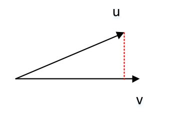
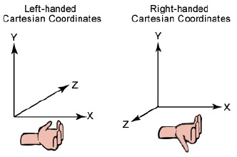

[TOC]

# 线性代数

## 基础知识

1. 本书中所有的向量的形式

$$
\vec{\mathbf{x}}=\left[ \begin{matrix} x_{1}\\ x_{2}\\ \vdots \\ x_{n} \end{matrix} \right]
$$

2. 矩阵的$\mathrm{F}$范数：设$\mathbf{A}=(a_{i,j})_{m \times n}$

$$
||\mathbf{A}||_{\mathrm{F}}=\sqrt{\sum_{i,j}a_{i,j}^{2}}
$$

它是向量的$\mathbf{L}_{2}$范数的推广。

3. 矩阵的迹$tr(\mathbf{A})=\sum_{i}a_{i,i}$。其性质有：

- $||\mathbf{A}||_{F}=\sqrt{tr(\mathbf{A}\mathbf{A}^{\mathrm{T}})}$
- $tr(\mathbf{A})=tr(\mathbf{A}^{\mathrm{T}})$
- 假设 $\mathbf{A}\in\mathbb{R}^{n\times m},\mathbf{B}\in\mathbb{R}^{n\times m}$ 则有：

$$
tr(\mathbf{AB})=tr(\mathbf{BA})
$$
- $tr(\mathbf{ABC})=tr(\mathbf{CAB})=tr(\mathbf{BCA})$

## 向量操作

1. 一组向量$\vec{v}_{1}, \vec{v}_{2},\cdots,\vec{v}_{n}$是线性相关的：指存在一组不全为零的实数$a_{1},a_{2},\cdots,a_{n}$使得：

$$
\sum_{i=1}^{n}a_{i}\vec{v}_{i}=\vec{0}
$$

一组向量 $\vec{v}_{1}, \vec{v}_{2},\cdots,\vec{v}_{n}$是线性无关的，当且仅当$a_{i}=0,i=1,2\cdots,n$时，才有
$$
\sum_{i=1}^{n}a_{i}\vec{v}_{i}=\vec{0}
$$

2. 一个向量空间所包含的最大线性无关向量的数目，称作该向量空间的维数。
3. 三维向量的点积：

$$
\vec{\mathbf{u}}\cdot \vec{\mathbf{v}}=u_{x}v_{x}+u_{y}v_{y}+u_{z}v_{z}=|\vec{\mathbf{u}}||\vec{\mathbf{v}}|\cos({\vec{\mathbf{u}},\vec{\mathbf{v}}})
$$

4. 三维向量的叉积

$$
\vec{\mathbf{w}}=\vec{\mathbf{u}}\times \vec{\mathbf{v}}=
\left[ 
\begin{matrix} 
\vec{\mathbf{i}} & \vec{\mathbf{j}} & \vec{\mathbf{k}} \\
u_{x} & u_{y} & u_{z} \\
v_{x} & v_{y} & v_{z}
\end{matrix} 
\right]
$$

其中$\vec{\mathbf{i}},\vec{\mathbf{j}},\vec{\mathbf{k}}$分别为$x,y,z$轴的单位向量。
$$
\vec{\mathbf{u}}=u_{x}\vec{\mathbf{i}}+u_{y}\vec{\mathbf{j}}+u_{z}\vec{\mathbf{k}},
\vec{\mathbf{{v}}}=v_{x}\vec{\mathbf{i}}+v_{y}\vec{\mathbf{j}}+v_{z}\vec{\mathbf{k}}
$$

* $\vec{\mathbf{u}}$和$\vec{\mathbf{v}}$的叉积垂直于$\vec{\mathbf{u}},\vec{\mathbf{v}}$构成的平面，其方向符合右手规则。
* 叉积的模等于$\vec{\mathbf{u}},\vec{\mathbf{v}}$构成的平行四边形的面积
* $\vec{\mathbf{u}}\times\vec{\mathbf{v}}=-\vec{\mathbf{v}}\times\vec{\mathbf{u}}$
* $\vec{\mathbf{u}}\times(\vec{\mathbf{v}}\times \vec{\mathbf{w}})=(\vec{\mathbf{u}}\cdot\vec{\mathbf{w}})\vec{\mathbf{v}}-(\vec{\mathbf{u}}\cdot\vec{\mathbf{v}})\vec{\mathbf{w}}$

5. 三维向量的混合积
$$
\begin{aligned}
& [ \begin{matrix} \vec{\mathbf{u}} & \vec{\mathbf{v}} & \vec{\mathbf{w}} \end{matrix} ] = (\vec{\mathbf{u}}\times\vec{\mathbf{v}})\cdot\vec{\mathbf{w}}=\vec{\mathbf{u}}\cdot(\vec{\mathbf{v}}\times \vec{\mathbf{w}}) \\
& = \left| \begin{matrix}
    u_{x} & u_{y} & u_{z} \\
    v_{x} & v_{y} & v_{z} \\
    w_{x} & w_{y} & w_{z}
\end{matrix} \right| = \left| \begin{matrix}
    u_{x} & v_{x} & w_{x} \\
    u_{y} & v_{y} & w_{y} \\
    u_{z} & v_{z} & w_{z}
\end{matrix} \right|
\end{aligned}
$$
* 其物理意义为：以 $\vec{\mathbf{u}},\vec{\mathbf{v}},\vec{\mathbf{w}}$ 为三个棱边所围成的平行六面体的体积。 当 $\vec{\mathbf{u}},\vec{\mathbf{v}},\vec{\mathbf{w}}$ 构成右手系时，该平行六面体的体积为正号。

6. 两个向量的并矢：
给定两个向量 $\vec{\mathbf{x}}=(x_{1},x_{2},\cdots,x_{n})^{T},\vec{\mathbf{y}}=(y_{1},y_{2},\cdots,y_{m})$ ，则向量的并矢记作：
$$
\vec{\mathbf{x}}\vec{\mathbf{y}}=
\left[
\begin{matrix}
    x_{1}y_{1} & x_{1}y_{2} & \cdots & x_{1}y_{m} \\
    x_{2}y_{1} & x_{2}y_{2} & \cdots & x_{2}y_{m} \\
    \vdots & \vdots & \ddots & \vdots \\
    x_{n}y_{1} & x_{n}y_{2} & \cdots & x_{n}y_{m} 
\end{matrix}
\right]
$$
也记作 $\vec{\mathbf{x}}\otimes\vec{\mathbf{y}}$ 或者 $\vec{\mathbf{x}}\vec{\mathbf{y}}^{T}$

## 矩阵运算
1. 给定两个矩阵 $\mathbf{A}=(a_{i,j})\in\mathbb{R}^{m\times n},\mathbf{B}=(b_{i,j})\in\mathbb{R}^{m\times n}$ ，定义：
* 阿达马积Hadamard product（又称作逐元素积）：
$$
\mathbf{A}\circ\mathbf{B}=
\left[
\begin{matrix}
    a_{1,1}b_{1,1} & a_{1,2}b_{1,2} & \cdots & a_{1,n}b_{1,n} \\
    a_{2,1}b_{2,1} & a_{2,2}b_{2,2} & \cdots & a_{2,n}b_{2,n} \\
    \vdots & \vdots & \ddots & \vdots \\
    a_{m,1}b_{m,1} & a_{m,2}b_{m,2} & \cdots & a_{m,n}b_{m,n}
\end{matrix}
\right]
$$

* 克罗内积Kronnecker product：
$$
\mathbf{A}\otimes\mathbf{B}=
\left[
\begin{matrix}
    a_{1,1}\mathbf{B} & a_{1,2}\mathbf{B} & \cdots & a_{1,n}\mathbf{B} \\
    a_{2,1}\mathbf{B} & a_{2,2}\mathbf{B} & \cdots & a_{2,n}\mathbf{B} \\
    \vdots & \vdots & \ddots & \vdots \\
    a_{m,1}\mathbf{B} & a_{m,2}\mathbf{B} & \cdots & a_{m,n}\mathbf{B}
\end{matrix}
\right]
$$

2. 设$\vec{\mathbf{x}},\vec{\mathbf{a}},\vec{\mathbf{b}},\vec{\mathbf{c}}$为n阶向量，$\mathbf{A},\mathbf{B},\mathbf{C},\mathbf{X}$为n阶方阵，则：
$$
\frac{\partial(\vec{\mathbf{a}}^{T}\vec{\mathbf{x}})}{\partial{\vec{\mathbf{x}}}}=
\frac{\partial(\vec{\mathbf{x}}^{T}\vec{\mathbf{a}})}{\partial{\vec{\mathbf{x}}}}=
\vec{\mathbf{a}}
$$

$$
\frac{\partial(\vec{\mathbf{a}}^{T}\mathbf{X}\vec{\mathbf{b}})}{\partial\mathbf{X}}=
\vec{\mathbf{a}}\vec{\mathbf{b}}^{T}=
\vec{\mathbf{a}}\otimes\vec{\mathbf{b}}\in\mathbb{R}^{n\times n}
$$

$$
\frac{\partial(\vec{\mathbf{a}}^{T}\mathbf{X}^{T}\vec{\mathbf{b}})}{\partial\mathbf{X}}=
\vec{\mathbf{b}}\vec{\mathbf{a}}^{T}=
\vec{\mathbf{b}}\otimes\vec{\mathbf{a}}\in\mathbb{R}^{n\times n}
$$

$$
\frac{\partial(\vec{\mathbf{a}}^{T}\mathbf{X}\vec{\mathbf{a}})}{\partial\mathbf{X}}=
\frac{\partial(\vec{\mathbf{a}}^{T}\mathbf{X}^{T}\vec{\mathbf{a}})}{\partial\mathbf{X}}=
\vec{\mathbf{a}}\otimes\vec{\mathbf{a}}
$$

$$
\frac{\partial(\vec{\mathbf{a}}^{T}\mathbf{X}^T\mathbf{X}\vec{\mathbf{b}})}{\partial\mathbf{X}}=
\mathbf{X}(\vec{\mathbf{a}}\otimes\vec{\mathbf{b}}+\vec{\mathbf{b}}\otimes\vec{\mathbf{a}})
$$

$$
\frac{\partial[(\mathbf{A}\vec{\mathbf{x}}+\vec{\mathbf{a}})^{T}\mathbf{C}(\mathbf{B}\vec{\mathbf{x}}+\vec{\mathbf{b}})]}{\partial\vec{\mathbf{x}}}=
\mathbf{A}^{T}\mathbf{C}(\mathbf{B}\vec{\mathbf{x}}+\vec{\mathbf{b}})+\mathbf{B}^{T}\mathbf{C}(\mathbf{A}\vec{\mathbf{x}}+\vec{\mathbf{a}})
$$

$$
\frac{\partial(\vec{\mathbf{x}}^{T}\mathbf{A}\vec{\mathbf{x}})}{\partial\vec{\mathbf{x}}}=
(\mathbf{A}+\mathbf{A}^{T})\vec{\mathbf{x}}
$$

$$
\frac{\partial[(\mathbf{X}\vec{\mathbf{b}}+\vec{\mathbf{c}})^{T}\mathbf{A}(\mathbf{X}\vec{\mathbf{b}}+\vec{\mathbf{c}})]}{\partial\mathbf{X}}=
(\mathbf{A}+\mathbf{A}^{T})(\mathbf{X}\vec{\mathbf{b}}+\vec{\mathbf{c}})\vec{\mathbf{b}}^{T}
$$

$$
\frac{\partial(\vec{\mathbf{b}}^{T}\mathbf{X}^{T}\mathbf{A}\mathbf{X}\vec{\mathbf{c}})}{\partial\mathbf{X}}=
\mathbf{A}^{T}\mathbf{X}\vec{\mathbf{b}}\vec{\mathbf{c}}^{T}+
\mathbf{A}\mathbf{X}\vec{\mathbf{c}}\vec{\mathbf{b}}^{T}
$$

3. 如果 $f$是一元函数，则：
* 其逐元向量函数为：
$$
f(\vec{\mathbf{x}})=
(f(x_{1}),f(x_{2}),\cdots,f(x_{n}))^{T}
$$
* 其逐矩阵函数为：
$$
f(\mathbf{X})=[f(x_{i,j})]
$$
* 其逐元导数分别为：
$$
\begin{aligned}
    &f'(\vec{\mathbf{x}})=(f'(x_{1}),f'(x_{2}),\cdots,f'(x_{n}))^{T} \\
    &f'(\mathbf{X})=[f'(x_{i,j})]
\end{aligned}
$$

4. 各种类型的偏导数：
* 标量对标量的偏导数
$$
\frac{\partial u}{\partial v}
$$

* 标量对向量（n维向量）的偏导数
$$
\frac{\partial u}{\partial\vec{\mathbf{v}}}=
\left(
\frac{\partial u}{\partial v_{1}},\frac{\partial u}{\partial v_{2}},\cdots,\frac{\partial u}{\partial v_{n}}
\right)^{T}
$$

* 标量对矩阵($m\times n$阶矩阵)的偏导数
$$
\frac{\partial u}{\partial\mathbf{V}}=
\left[
\begin{matrix}
    \frac{\partial u}{\partial V_{1,1}} & \frac{\partial u}{\partial V_{1,2}} & \cdots & \frac{\partial u}{\partial V_{1,n}} \\
    \frac{\partial u}{\partial V_{2,1}} & \frac{\partial u}{\partial V_{2,2}} & \cdots & \frac{\partial u}{\partial V_{2,n}} \\
    \vdots & \vdots & \ddots & \vdots \\
    \frac{\partial u}{\partial V_{m,1}} & \frac{\partial u}{\partial V_{m,2}} & \cdots & \frac{\partial u}{\partial V_{m,n}}
\end{matrix}
\right]
$$

* 向量（$m$ 维向量）对标量的偏导数
$$
\frac{\partial\vec{\mathbf{u}}}{\partial v}=
\left(
\frac{\partial u_{1}}{\partial v},\frac{\partial u_{2}}{\partial v},\cdots,\frac{\partial u_{m}}{\partial v}
\right)^{T}
$$

* 向量（$m$ 维向量）对向量 ($n$ 维向量) 的偏导数（雅可比矩阵，行优先）
$$
\frac{\partial\vec{\mathbf{u}}}{\partial\vec{\mathbf{v}}}=
\left[
\begin{matrix}
    \frac{\partial u_{1}}{\partial v_{1}} & \frac{\partial u_{1}}{\partial v_{2}} & \cdots & \frac{\partial u_{1}}{\partial v_{n}} \\
    \frac{\partial u_{2}}{\partial v_{1}} &  \frac{\partial u_{2}}{\partial v_{2}} & \cdots & \frac{\partial u_{2}}{\partial v_{n}} \\
    \vdots & \vdots & \ddots & \vdots \\
    \frac{\partial u_{m}}{\partial v_{1}} & \frac{\partial u_{m}}{\partial v_{2}} & \cdots & \frac{\partial u_{m}}{\partial v_{n}}
\end{matrix}
\right]
$$
>如果为列优先，则为上面矩阵的转置
* 矩阵($m\times n$ 阶矩阵)对标量的偏导数
$$
\frac{\partial\mathbf{U}}{\partial v}=
\left[
\begin{matrix}
    \frac{\partial U_{1,1}}{\partial v} & \frac{\partial U_{1,2}}{\partial v} & \cdots & \frac{\partial U_{1,n}}{\partial v} \\
    \frac{\partial U_{2,1}}{\partial v} & \frac{\partial U_{2,2}}{\partial v} & \cdots & \frac{\partial U_{2,n}}{\partial v} \\
    \vdots & \vdots & \ddots & \vdots \\
    \frac{\partial U_{m,1}}{\partial v} & \frac{\partial U_{m,2}}{\partial v} & \cdots & \frac{\partial U_{m,n}}{\partial v}
\end{matrix}
\right]
$$
* 更复杂的情况依次类推。对于 $\frac{\partial\mathbf{u}}{\partial\mathbf{v}}$。根据numpy的术语：
    >假设 $\mathbf{u}$ 的 ndim（维度）为  $d_{u}$
    对于标量， ndim为 0；对于向量， ndim为1；对于矩阵，ndim为 2
    假设 $\mathbf{v}$ 的 ndim为 $d_{v}$
    则 $\frac{\partial\mathbf{u}}{\partial\mathbf{v}}$ 的 ndim为$d_{u}+d_{v}$

5. 对于矩阵的迹，有下列偏导数成立：
$$
\frac{\partial[tr(f(\mathbf{X}))]}{\partial\mathbf{X}}=
(f'(\mathbf{X}))^{T}
$$

$$
\frac{\partial[tr(\mathbf{AXB})]}{\partial\mathbf{X}}=
\mathbf{A}^{T}\mathbf{B}^{T}
$$

$$
\frac{\partial[tr(\mathbf{A}\mathbf{X}^{T}\mathbf{B})]}{\partial\mathbf{X}}=\mathbf{BA}
$$

$$
\frac{\partial[tr(\mathbf{A}\otimes\mathbf{X})]}{\partial\mathbf{X}}=tr(\mathbf{A})\mathbf{I}
$$

$$
\frac{\partial[tr(\mathbf{AXBX})]}{\partial\mathbf{X}}=
\mathbf{A}^{T}\mathbf{X}^{T}\mathbf{B}^{T}+\mathbf{B}^{T}\mathbf{X}\mathbf{A}^{T}
$$

$$
\frac{\partial[tr(\mathbf{X}^{T}\mathbf{BXC})]}{\partial\mathbf{X}}=(\mathbf{B}^{T}+\mathbf{B})\mathbf{XCC}^{T}
$$

$$
\frac{\partial[tr(\mathbf{C}^{T}\mathbf{X}^{T}\mathbf{BXC})]}{\partial\mathbf{X}}=\mathbf{BXC}+\mathbf{B}^{T}\mathbf{XC}^{T}
$$

$$
\frac{\partial[tr(\mathbf{AXBX}^{T}\mathbf{C})]}{\partial\mathbf{X}}=\mathbf{A}^{T}\mathbf{C}^{T}\mathbf{XB}^{T}+\mathbf{CAXB}
$$

$$
\frac{\partial[tr((\mathbf{AXB}+\mathbf{C})(\mathbf{AXB}+\mathbf{C}))]}{\partial\mathbf{X}}=2\mathbf{A}^{T}(\mathbf{AXB+C})\mathbf{B}^{T}
$$

6. 假设 $\mathbf{U=f(X)}$ 是关于 $\mathbf{X}$ 的矩阵值函数（$f:\mathbb{R}^{m\times n}\rightarrow\mathbb{R}^{m\times n}$），且 $g(\mathbf{U})$ 是关于 $\mathbf{U}$ 的实值函数（$g:\mathbb{R}^{m\times n}\rightarrow\mathbb{R}$），则下面链式法则成立：

$$
\begin{aligned}
\frac{\partial g(\mathbf{U})}{\partial\mathbf{X}}&=
\left( \frac{\partial g(\mathbf{U})}{\partial x_{i,j}} \right)=
\left[
    \begin{matrix}
        \frac{\partial g(\mathbf{U})}{\partial x_{1,1}} & \frac{\partial g(\mathbf{U})}{\partial x_{1,2}} & \cdots & \frac{\partial g(\mathbf{U})}{\partial x_{1,n}} \\
        \frac{\partial g(\mathbf{U})}{\partial x_{2,1}} & \frac{\partial g(\mathbf{U})}{\partial x_{2,2}} & \cdots & \frac{\partial g(\mathbf{U})}{\partial x_{2,n}} \\
        \vdots & \vdots & \ddots & \vdots \\
        \frac{\partial g(\mathbf{U})}{\partial x_{m,1}} & \frac{\partial g(\mathbf{U})}{\partial x_{m,2}} & \cdots & \frac{\partial g(\mathbf{U})}{\partial x_{m,n}} \\
    \end{matrix}
\right] \\
& = \left( \sum_{k}\sum_{l}\frac{\partial g(\mathbf{U})}{\partial u_{k,l}}\frac{\partial u_{k,l}}{\partial x_{i,j}} \right) \\
& =tr\left[ \left( \frac{\partial g\mathbf{U}}{\partial\mathbf{U}} \right)^{T}\frac{\partial\mathbf{U}}{\partial x_{i,j}} \right]
\end{aligned}
$$
