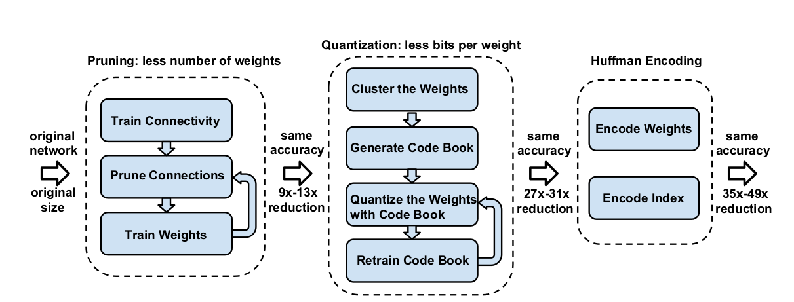

# GEMM相关算法

## 模型压缩加速

### 前言

2015年，Han发表的[Deep Compression](./模型压缩加速/DEEP COMPRESSION.pdf)是一篇对于模型压缩方法的综述型文章，将裁剪、权值共享和量化、编码等方式运用在模型压缩上，取得了非常好的效果，作为ICLR2016的best paper，也引起了模型压缩方法研究的热潮。

目前深度学习模型压缩方法的研究主要可以分为以下几个方向： 
**更精细模型的设计**，目前的很多网络都具有模块化的设计，在深度和宽度上都很大，这也造成了参数的冗余很多，因此有很多关于模型设计的研究，如SqueezeNet、MobileNet等，使用更加细致、高效的模型设计，能够很大程度的减少模型尺寸，并且也具有不错的性能。 
**模型裁剪**，结构复杂的网络具有非常好的性能，其参数也存在冗余，因此对于已训练好的模型网络，可以寻找一种有效的评判手段，将不重要的connection或者filter进行裁剪来减少模型的冗余。 
**核的稀疏化**，在训练过程中，对权重的更新进行诱导，使其更加稀疏，对于稀疏矩阵，可以使用更加紧致的存储方式，如CSC，但是使用稀疏矩阵操作在硬件平台上运算效率不高，容易受到带宽的影响，因此加速并不明显。 

除此之外，**量化、Low-rank分解、迁移学习**等方法也有很多研究，并在模型压缩中起到了非常好的效果。
- [DEEP COMPRESSION](./模型压缩加速/DEEP COMPRESSION.pdf)

```mermaid
graph LR
pruning[剪枝]-->trained_quantization[量化训练]
trained_quantization[量化训练]-->Huffman_coding[霍夫曼编码]
```

通过上述方法可以减少35~49倍的存储

上图中训练时，4种颜色对应四个不同的权值，所以可以大大减少量化bit数。卷积层可以到8bit，全连接层可以到5bit。

### 基于核的稀疏化方法

核的稀疏化，是在训练过程中，对权重的更新加以正则项进行诱导，使其更加稀疏，使大部分的权值都为0。核的稀疏化方法分为regular和irregular，regular的稀疏化后，裁剪起来更加容易，尤其是对im2col的矩阵操作，效率更高；而irregular的稀疏化后，参数需要特定的存储方式，或者需要平台上稀疏矩阵操作库的支持

- Learning Structured Sparsity in Deep Neural Networks [论文地址](./模型压缩加速/Learning Structured Sparsity in Deep Neural Networks.pdf) 

本文作者提出了一种Structured Sparsity Learning的学习方式，能够学习一个稀疏的结构来降低计算消耗，所学到的结构性稀疏化能够有效的在硬件上进行加速。 传统非结构化的随机稀疏化会带来不规则的内存访问，因此在GPU等硬件平台上无法有效的进行加速。 作者在网络的目标函数上增加了group lasso的限制项，可以实现filter级与channel级以及shape级稀疏化。所有稀疏化的操作都是基于下面的loss func进行的，其中Rg为group lasso： 
$$
E ( W ) = E _ { D } ( W ) + \lambda \cdot R ( W ) + \lambda _ { g } \cdot \sum _ { i = 1 } ^ { L } R _ { g } \left( w ^ { ( l ) } \right)
$$
则filter-channel wise： 

由于在GEMM中将weight tensor拉成matrix的结构，因此可以通过将filter级与shape级的稀疏化进行结合来将2D矩阵的行和列稀疏化，再分别在矩阵的行和列上裁剪掉剔除全为0的值可以来降低矩阵的维度从而提升模型的运算效率。该方法是regular的方法，压缩粒度较粗，可以适用于各种现成的算法库，但是训练的收敛性和优化难度不确定。

作者的源码为：https://github.com/wenwei202/caffe/tree/scnn

- Dynamic Network Surgery for Efficient DNNs [论文地址](./模型压缩加速/Dynamic Network Surgery for Efficient DNNs.pdf) 

作者提出了一种动态的模型裁剪方法，包括以下两个过程：pruning和splicing，其中pruning就是将认为不中要的weight裁掉，但是往往无法直观的判断哪些weight是否重要，因此在这里增加了一个splicing的过程，将哪些重要的被裁掉的weight再恢复回来，类似于一种外科手术的过程，将重要的结构修补回来，它的算法如下： 

作者通过在W上增加一个T来实现，T为一个2值矩阵，起到的相当于一个mask的功能，当某个位置为1时，将该位置的weight保留，为0时，裁剪。在训练过程中通过一个可学习mask将weight中真正不重要的值剔除，从而使得weight变稀疏。由于在删除一些网络的连接，会导致网络其他连接的重要性发生改变，所以通过优化最小损失函数来训练删除后的网络比较合适。 
该算法采取了剪枝与嫁接相结合、训练与压缩相同步的策略完成网络压缩任务。通过网络嫁接操作的引入，避免了错误剪枝所造成的性能损失，从而在实际操作中更好地逼近网络压缩的理论极限。属于irregular的方式，但是ak和bk的值在不同的模型以及不同的层中无法确定，并且容易受到稀疏矩阵算法库以及带宽的限制。
论文源码：https://github.com/yiwenguo/Dynamic-Network-Surgery

- Training Skinny Deep Neural Networks with Iterative Hard Thresholding Methods 论文地址 

作者想通过训练一个稀疏度高的网络来降低模型的运算量，通过在网络的损失函数中增加一个关于W的L0范式可以降低W的稀疏度，但是L0范式就导致这是一个N-P难题，是一个难优化求解问题，因此作者从另一个思路来训练这个稀疏化的网络。算法的流程如下

先正常训练网络s1轮，然后Ok(W)表示选出W中数值最大的k个数，而将剩下的值置为0，supp(W,k)表示W中最大的k个值的序号，继续训练s2轮，仅更新非0的W，然后再将之前置为0的W放开进行更新，继续训练s1轮，这样反复直至训练完毕。 同样也是对参数进行诱导的方式，边训练边裁剪，先将认为不重要的值裁掉，再通过一个restore的过程将重要却被误裁的参数恢复回来。也是属于irregular的方式，边训边裁，性能不错，压缩的力度难以保证。

### 基于模型裁剪的方法

对以训练好的模型进行裁剪的方法，是目前模型压缩中使用最多的方法，通常是寻找一种有效的评判手段，来判断参数的重要性，将不重要的connection或者filter进行裁剪来减少模型的冗余。同样也分为regular和irregular的方式。 这类方法最多，下面列举几篇典型的方案。

- Pruning Filters for Efficient Convnets [论文地址](./模型压缩加速/Pruning Filters for Efficient Convnets.pdf) 

作者提出了基于量级的裁剪方式，用weight值的大小来评判其重要性，对于一个filter，其中所有weight的绝对值求和，来作为该filter的评价指标，将一层中值低的filter裁掉，可以有效的降低模型的复杂度并且不会给模型的性能带来很大的损失，算法流程如下：

作者在裁剪的时候同样会考虑每一层对裁剪的敏感程度，作者会单独裁剪每一层来看裁剪后的准确率。对于裁剪较敏感的层，作者使用更小的裁剪力度，或者跳过这些层不进行裁剪。目前这种方法是实现起来较为简单的，并且也是非常有效的，它的思路非常简单，就是认为参数越小则越不重要。

- Network Trimming: A Data-Driven Neuron Pruning Approach towards Efficient Deep Architectures [论文地址](./模型压缩加速/Network Trimming: A Data-Driven Neuron Pruning Approach towards Efficient Deep Architectures.pdf) 

作者认为，在大型的深度学习网络中，大部分的神经元的激活都是趋向于零的，而这些激活为0的神经元是冗余的，将它们剔除可以大大降低模型的大小和运算量，而不会对模型的性能造成影响，于是作者定义了一个量APoZ（Average Percentage of Zeros）来衡量每一个filter中激活为0的值的数量，来作为评价一个filter是否重要的标准。APoZ定义如下： 

作者发现在VGG-16中，有631个filter的APoZ超过了90%，也就说明了网络中存在大量的冗余。作者的裁剪方式如下： 

但是作者仅在最后一个卷积层和全连接层上进行了实验，因此该方法在实际中的效果很难保证。

- An Entropy-based Pruning Method for CNN Compression [论文地址](./模型压缩加速/An Entropy-based Pruning Method for CNN Compression.pdf) 

作者认为通过weight值的大小很难判定filter的重要性，通过这个来裁剪的话有可能裁掉一些有用的filter。因此作者提出了一种基于熵值的裁剪方式，利用熵值来判定filter的重要性。 作者将每一层的输出通过一个Global average Pooling将feature map转换为一个长度为c（filter数量）的向量，对于n张图像可以得到一个n*c的矩阵，对于每一个filter，将它分为m个bin，统计每个bin的概率，然后计算它的熵值 利用熵值来判定filter的重要性，再对不重要的filter进行裁剪。第j个feature map熵值的计算方式如下： 

在retrain中，作者使用了这样的策略，即每裁剪完一层，通过少数几个迭代来恢复部分的性能，当所有层都裁剪完之后，再通过较多的迭代来恢复整体的性能，作者提出，在每一层裁剪过后只使用很少的训练步骤来恢复性能，能够有效的避免模型进入到局部最优。作者将自己的retrain方式与传统的finetuning方式进行比较，发现作者的方法能够有效的减少retrain的步骤，并也能达到不错的效果。 
在VGG16上作者的裁剪方式和结果如下，由于作者考虑VGG-16全连接层所占的参数量太大，因此使用GAP的方式来降低计算量： 

- Designing Energy-Efficient Convolutional Neural Networks using Energy-Aware Pruning [论文地址](https://arxiv.org/pdf/1611.05128.pdf) 

这篇文章也是今年的CVPR，作者认为以往的裁剪方法，都没有考虑到模型的带宽以及能量的消耗，因此无法从能量利用率上最大限度的裁剪模型，因此提出了一种基于能量效率的裁剪方式。 作者指出一个模型中的能量消耗包含两个部分，一部分是计算的能耗，一部分是数据转移的能耗，在作者之前的一片论文中（与NVIDIA合作，Eyeriss），提出了一种估计硬件能耗的工具，能够对模型的每一层计算它们的能量消耗。然后将每一层的能量消耗从大到小排序，对能耗大的层优先进行裁剪，这样能够最大限度的降低模型的能耗，对于需要裁剪的层，根据weight的大小来选择不重要的进行裁剪，同样的作者也考虑到不正确的裁剪，因此将裁剪后模型损失最大的weight保留下来。 

- Coarse Pruning of Convolutional Neural Networks with Random Masks 论文地址 

此文的方法比较有意思，作者认为，既然我无法直观上的判定filter的重要性，那么就采取一种随机裁剪的方式，然后对于每一种随机方式统计模型的性能，来确定局部最优的裁剪方式。 这种随机裁剪方式类似于一个随机mask，假设有M个潜在的可裁剪weight，那么一共就有2^M个随机mask。假设裁剪比例为a，那么每层就会随机选取ML*a个filter，一共随机选取N组组合，然后对于这N组组合，统计裁剪掉它们之后模型的性能，然后选取性能最高的那组作为局部最优的裁剪方式。可能需要尝试多个mask才能得到较好的结果。

- Efficient Gender Classification Using a Deep LDA-Pruned Net [论文地址](https://arxiv.org/pdf/1704.06305.pdf) 

作者发现，在最后一个卷积层中，经过LDA分析发现对于每一个类别，有很多filter之间的激活是高度不相关的，因此可以利用这点来剔除大量的只具有少量信息的filter而不影响模型的性能。 作者在VGG-16上进行实验，VGG-16的conv5_3具有512个filter，将每一个filter的输出值中的最大值定义为该filter的fire score，因此对应于每一张图片就具有一个512维的fire向量，当输入一堆图片时，就可以得到一个N*512的fire矩阵，作者用intra-class correlation来衡量filter的重要性

具体实现如下： 

其中： 

Sw为类内距离，Sb为类间距离，作者这样做的目的是通过只保留对分类任务提取特征判别性最强的filter，来降低模型的冗余。 在前面几个卷积层，由于提取的特征都是很简单的特征，如边缘、颜色，直接对它们求ICC可能难以达到好的效果，因此作者在这些层之后接了deconv层，将特征映射到pixel级别，再来计算。 对于VGG最后用来分类的全连接层，作者认为参数量太大，故用Bayesian或者SVM来替代，在目前的ResNet或者Inception中不存在这样的问题，可以不用考虑。在VGG16上，本文方法裁剪的力度还是比较大的，但是本文作者做的任务为性别识别，在其他任务中的效果未知。 