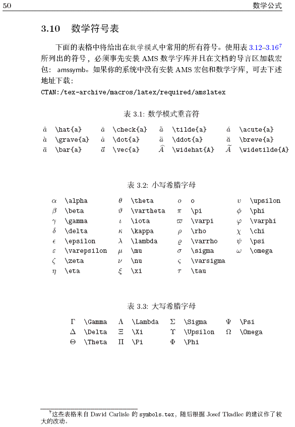
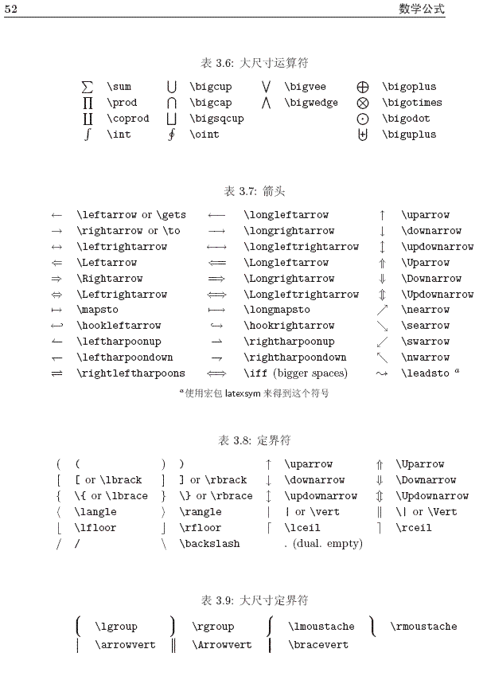
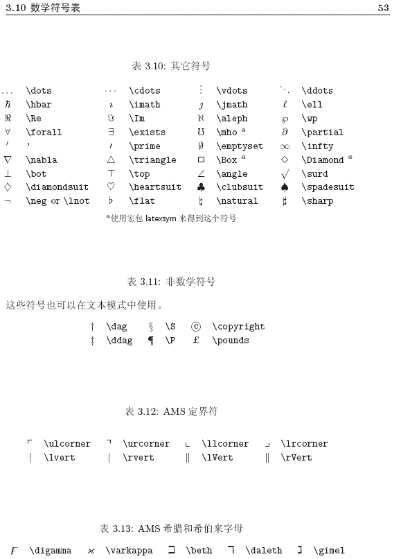
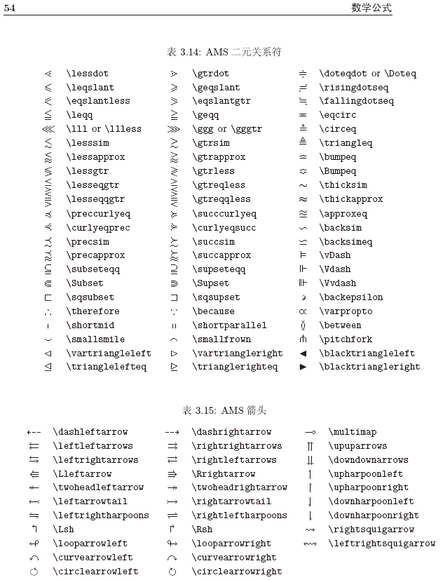

# latex常用符号

[TOC]

## 指数和下标

可以用^和_后加相应字符来实现。比如：


## 矩阵

```latex
$$
  \begin{matrix}
   1 & 2 & 3 \\
   4 & 5 & 6 \\
   7 & 8 & 9
  \end{matrix} \tag{1}
$$
```


## 平方根（square root）

输入命令为：`\sqrt`，n 次方根相应地为: `\sqrt[n]`。方根符号的大小由LATEX自动加以调整。也可用``\surd `仅给出符号


## 表达式的上、下方画出水平线

命令\overline 和\underline 


## 表达式的上、下方给出一水平的大括号

命令\overbrace 和\underbrace 


## 向量（Vectors）上方小箭头（arrow symbols）

这可由\vec 得到。另两个命令\overrightarrow 和\overleftarrow在定义从A 到B 的向量时非常有用


## 分数（fraction）


## 积分运算符

用\int 来生成。求和运算符（sum operator）由\sum 生成。乘积运算符（product operator）由\prod 生成。上限和下限用^ 和_来生成，类似于上标和下标


## 数学模式重音符&小写希腊字母&大写希腊字母



## 二元关系符&二元运算符


## 大尺寸运算符&箭头&定界符&大尺寸定界符



## 其他符号&非数学符号&AMS定界符&AMS希腊和希伯来字母



## AMS二元关系符&AMS箭头



## AMS二元否定关系符和箭头&AMS二元运算符


## AMS其他符号&数学字母

